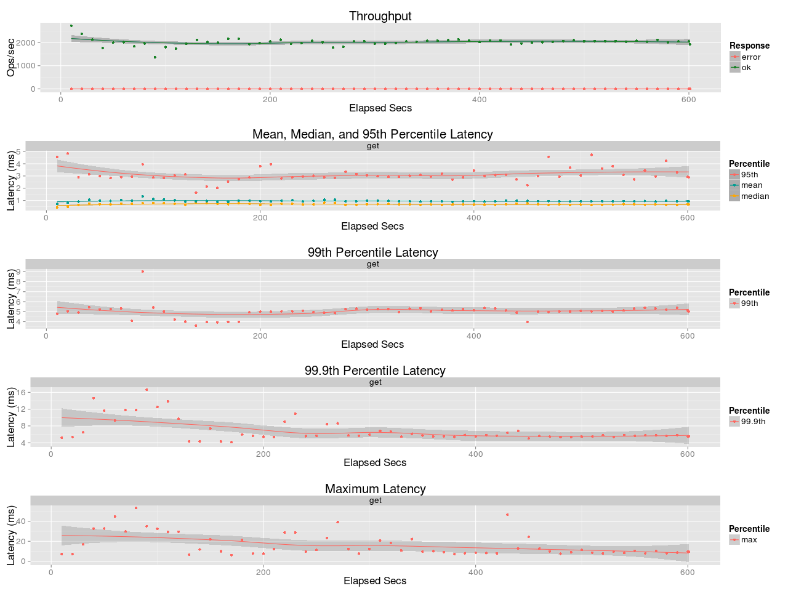
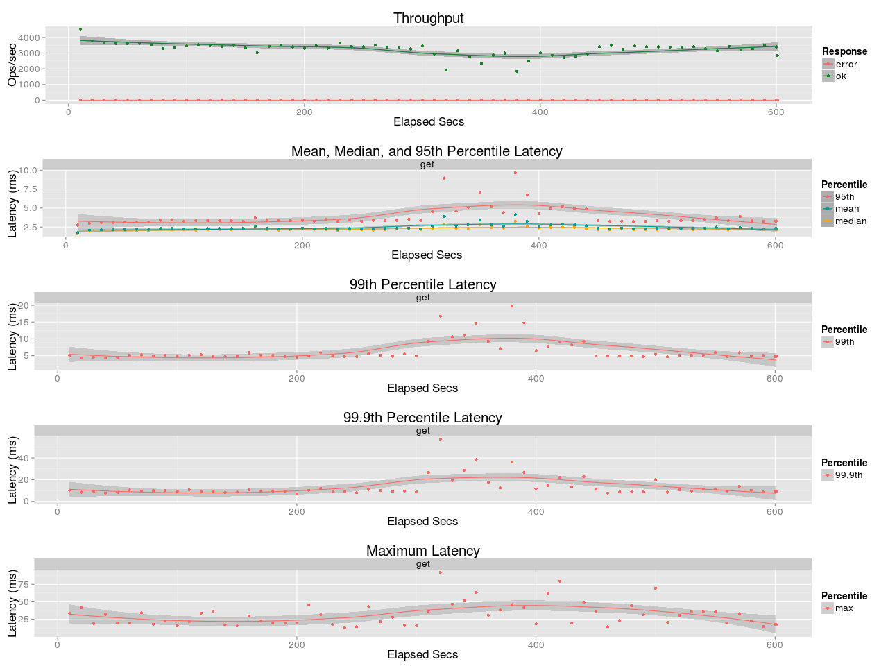

# coap-rs

[](https://travis-ci.org/Covertness/coap-rs)
[](https://ci.appveyor.com/project/Covertness/coap-rs)

[](https://crates.io/crates/coap)
[](https://coveralls.io/github/Covertness/coap-rs?branch=master)
[](./LICENSE)

A fast and stable [Constrained Application Protocol(CoAP)](https://tools.ietf.org/html/rfc7252) library implemented in Rust.

[Documentation](http://covertness.github.io/coap-rs/coap/index.html)

## Installation

First add this to your `Cargo.toml`:

```toml
[dependencies]
coap = "0.4"
```

Then, add this to your crate root:

```rust
extern crate coap;
```

## Example

### Server:
```rust
extern crate coap;

use std::io;
use coap::{CoAPResponse, CoAPRequest};

fn request_handler(req: CoAPRequest) -> Option<CoAPResponse> {
	println!("Receive request: {:?}", req);
	response
}

fn main() {
	let addr = "127.0.0.1:5683";

	let mut server = CoAPServer::new(addr).unwrap();
	server.handle(request_handler).unwrap();

	println!("Server up on {}", addr);
    println!("Press any key to stop...");
	io::stdin().read_line(&mut String::new()).unwrap();

	println!("Server shutdown");
}
```

### Client:
```rust
extern crate coap;

use coap::{CoAPClient, CoAPResponse};

fn main() {
	let url = "coap://127.0.0.1:5683/Rust";
	println!("Client request: {}", url);

	let response: CoAPResponse = CoAPClient::request(url).unwrap();
	println!("Server reply: {}", String::from_utf8(response.message.payload).unwrap());
}
```

## Benchmark
### Using one thread


### Using eight thread


Tests were performed using [basho_bench](https://github.com/basho/basho_bench).
